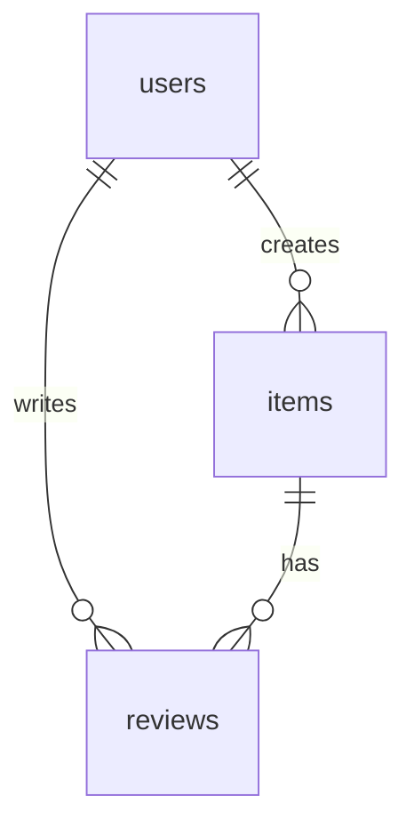
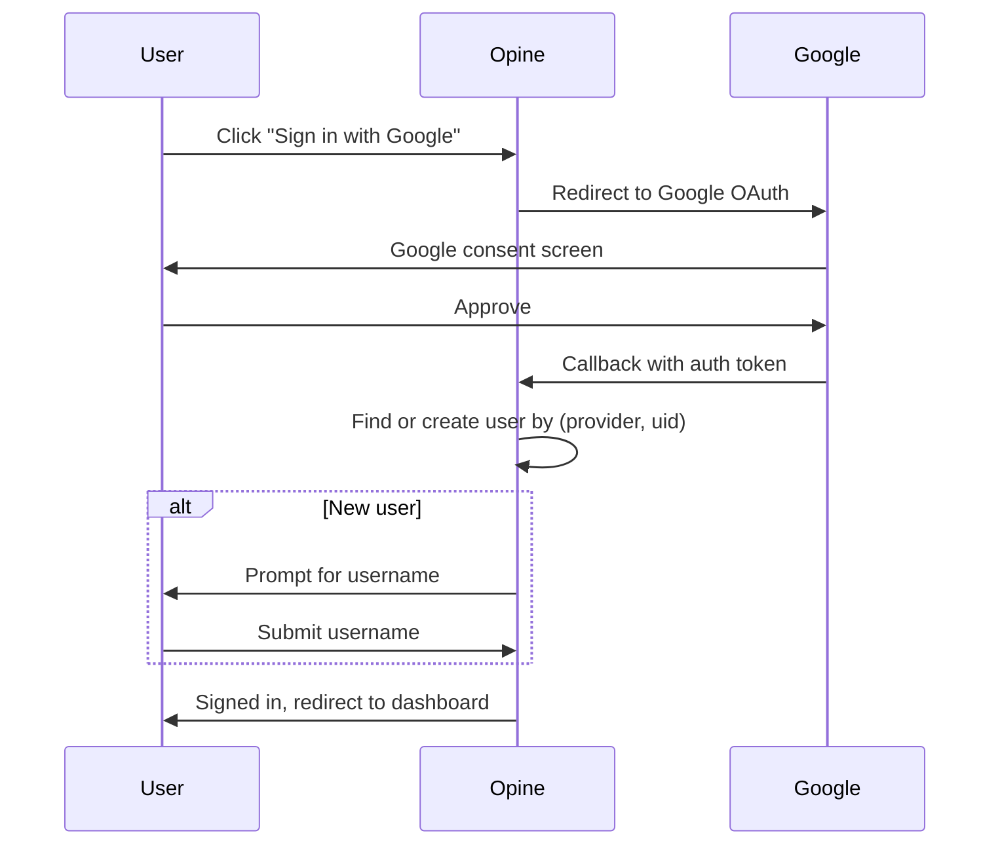

# Opine Technical Design Document

## 1. Project Overview

Opine is a review aggregation web application allowing users to rate and review Places, Experiences, and Things.

- **Core Philosophy:** A strict 6-point integer scale (1-6) to force decisive opinions.
- **Key Features:** User Reviews, Image Galleries, Dynamic Categories (ABV/Producer), Curation Lists, and AI-Powered Insights (Auto-fill metadata & Sentiment summaries).
- **Tone:** Informal, friendly, and opinionated.

---

## 2. Technology Stack

### Core Framework (The Monolith)

| Component       | Technology                                      |
| --------------- | ----------------------------------------------- |
| Framework       | Ruby on Rails 8.1 (Ruby 4.0.1)                  |
| Frontend        | Hotwire (Turbo + Stimulus)                      |
| Database        | PostgreSQL 14+                                  |
| Authentication  | Devise + OmniAuth (Google OAuth2)               |
| Authorization   | Pundit                                          |
| File Storage    | ActiveStorage (Local → R2/Spaces)               |
| Search          | pg_search (full-text on PostgreSQL)             |
| Background Jobs | Solid Queue (built into Rails 8.1)              |
| AI Model        | Gemini 3 Flash (via google-generative-ai gem)   |

> [!NOTE]
> **Why Flash?** Low latency is critical for auto-filling forms.

### Mobile Wrapper

| Component | Technology                 |
| --------- | -------------------------- |
| Framework | Turbo Native (iOS/Android) |

---

## 3. Data Architecture (Schema)

### 3.1 Core Concepts

- **User:** An authenticated account that can create items, reviews.
- **Item:** The entity being reviewed (e.g., "Pappy Van Winkle 15yr").
- **Review:** A user's opinion on an item (score + optional text + optional images).

### 3.2 Constants

```ruby
CATEGORY_MAP = {
  'Places'      => ['Restaurants', 'Bars', 'Parks', 'Museums'],
  'Experiences' => ['Concerts', 'Festivals', 'Movies', 'Games', 'TV Shows'],
  'Things'      => ['Beer', 'Wine', 'Liquor']
}

# Each subcategory's identifier field(s) — used for display_label and uniqueness.
# Values can be a single symbol or an array for compound identifiers.
IDENTIFIER_FIELD = {
  'Restaurants' => :city,
  'Bars'        => :city,
  'Parks'       => :city,
  'Museums'     => :city,
  'Beer'        => :brewery,
  'Wine'        => [:winemaker, :vintage],   # compound identifier
  'Liquor'      => :producer,
  'Movies'      => :director,
  'TV Shows'    => :season,
  'Games'       => :developer
}

ATTRIBUTE_DEFINITIONS = {
  'Restaurants' => [:cuisine, :price_range, :neighborhood],
  'Bars'        => [:vibe, :specialty, :neighborhood, :price_range],
  'Liquor'      => [:abv, :producer, :age_statement, :type],
  'Wine'        => [:varietal, :region, :vintage, :winemaker, :style],
  'Beer'        => [:style, :brewery, :abv],
  'Movies'      => [:director, :studio, :release_year, :genre],
  'TV Shows'    => [:creator, :network, :season, :genre],
  'Games'       => [:platform, :developer, :publisher, :genre]
}
```

> [!NOTE]
> **Compound Identifiers:** Wine uses `[:winemaker, :vintage]` so display labels read "Pinot Noir — Kosta Browne 2020". All other subcategories use a single identifier. To add compound identifiers for another subcategory, just change its `IDENTIFIER_FIELD` value to an array.

> [!IMPORTANT]
> **Required Attributes:** All attributes defined in `ATTRIBUTE_DEFINITIONS` for a subcategory are validated as required. Items cannot be saved without filling in every defined attribute.

### 3.3 Database Tables

#### `users`

| Column              | Type     | Notes                                  |
| ------------------- | -------- | -------------------------------------- |
| `id`                | UUID     | Primary key                            |
| `email`             | String   | Required, unique (Devise)              |
| `encrypted_password`| String   | Devise (nullable for OAuth-only users) |
| `username`          | String   | Required, unique, 3-20 chars           |
| `display_name`      | String   | Optional                               |
| `bio`               | Text     | Optional, max 500 chars                |
| `avatar`            | Attachment | ActiveStorage                        |
| `role`              | Enum     | `user`, `admin`, `superadmin` (default: user) |
| `provider`          | String   | OAuth provider (e.g., "google")        |
| `uid`               | String   | OAuth unique ID from provider          |
| `timestamps`        | —        |                                        |

**Index:** Unique on `(provider, uid)` for OAuth lookups
**Index:** Unique on `username`
**Index:** Unique on `email`

#### `items`

| Column               | Type        | Notes                                                  |
| -------------------- | ----------- | ------------------------------------------------------ |
| `id`                 | UUID        | Primary key                                            |
| `name`               | String      | Required, max 255 chars                                |
| `category`           | String      | Required, from CATEGORY_MAP keys                       |
| `subcategory`        | String      | Required, from CATEGORY_MAP values                     |
| `metadata`           | JSONB       | Stores factual data: ABV, Director, etc.               |
| `ai_summary`         | Text        | "General Public Sentiment" generated by Gemini         |
| `ai_last_updated_at` | Datetime    |                                                        |
| `average_score`      | Decimal     | Denormalized, updated on review create/update/destroy  |
| `reviews_count`      | Integer     | Counter cache                                          |
| `created_by_user_id` | FK          | → users                                                |
| `city`               | String      | **Generated** (stored) from `metadata->>'city'`        |
| `producer`           | String      | **Generated** (stored) from `metadata->>'producer'`    |
| `vintage`            | String      | **Generated** (stored) from `metadata->>'vintage'`     |
| `release_year`       | String      | **Generated** (stored) from `metadata->>'release_year'`|
| `season`             | String      | **Generated** (stored) from `metadata->>'season'`      |
| `timestamps`         | —           |                                                        |

**Indexes:**
- `(category, subcategory)`
- `(name)` GIN for full-text search
- **Uniqueness Constraints (Partial Indexes):**
  - **Restaurants/Bars:** `(name, metadata->>'city')`
  - **Reviewable Items (Wine/Beer):** `(name, metadata->>'producer', metadata->>'vintage')`
  - **Movies:** `(name, metadata->>'release_year')`
  - **TV Shows:** `(name, metadata->>'season')`

#### `reviews`

| Column       | Type    | Notes                              |
| ------------ | ------- | ---------------------------------- |
| `id`         | UUID    | Primary key                        |
| `user_id`    | FK      | → users                            |
| `item_id`    | FK      | → items                            |
| `score`      | Integer | Required, 1-6                      |
| `body`       | Text    | Optional, max 5000 chars           |
| `timestamps` | —       |                                    |

**Constraints:** Unique index on `(user_id, item_id)` — one review per user per item.

**Images:** Up to 5 images via ActiveStorage `has_many_attached :images`


### 3.4 Entity Relationship Diagram



---

## 4. Authentication (Devise + Google SSO)

### 4.1 Sign-in Options

| Method              | Implementation                          |
| ------------------- | --------------------------------------- |
| Email/Password      | Devise (standard)                       |
| Google SSO          | OmniAuth + `omniauth-google-oauth2` gem |

### 4.2 Google OAuth Flow



### 4.3 OmniAuth Configuration

**File:** `config/initializers/devise.rb`

```ruby
config.omniauth :google_oauth2,
  ENV['GOOGLE_CLIENT_ID'],
  ENV['GOOGLE_CLIENT_SECRET'],
  scope: 'email,profile',
  prompt: 'select_account'
```

### 4.4 New OAuth User Flow

When a user signs in via Google for the first time:

1. User record created with `provider`, `uid`, `email` from Google
2. `display_name` auto-filled from Google profile name
3. User redirected to `/users/complete_profile` to choose a unique `username`
4. `encrypted_password` remains null (user must use Google to sign in)

> [!NOTE]
> Users who signed up with email/password can later link their Google account. Users who signed up with Google cannot add a password (OAuth-only).

### 4.5 Environment Variables

| Variable              | Description                      |
| --------------------- | -------------------------------- |
| `GOOGLE_CLIENT_ID`    | From Google Cloud Console        |
| `GOOGLE_CLIENT_SECRET`| From Google Cloud Console        |

---

## 5. Authorization (Pundit Policies)

### 5.1 User Roles

| Role          | Description                                                    |
| ------------- | -------------------------------------------------------------- |
| `user`        | Default role. Can create/manage own content.                   |
| `admin`       | Moderator. Can edit/delete any content, merge duplicate items. |
| `superadmin`  | Full access. Can manage admins and system settings.            |

### 5.2 Permission Matrix

| Resource   | Action    | User                  | Admin              | Superadmin         |
| ---------- | --------- | --------------------- | ------------------ | ------------------ |
| **Item**   | Create    | ✅                    | ✅                 | ✅                 |
|            | Read      | ✅                    | ✅                 | ✅                 |
|            | Update    | Creator only          | ✅ Any             | ✅ Any             |
|            | Delete    | Creator (if no reviews) | ✅ Any           | ✅ Any             |
|            | Merge     | ❌                    | ✅                 | ✅                 |
| **Review** | Create    | ✅                    | ✅                 | ✅                 |
|            | Read      | ✅                    | ✅                 | ✅                 |
|            | Update    | Author only           | ✅ Any             | ✅ Any             |
|            | Delete    | Author only           | ✅ Any             | ✅ Any             |
| **User**   | Create    | Public signup         | ❌                 | ✅ (create admins) |
|            | Read      | ✅                    | ✅                 | ✅                 |
|            | Update    | Self only             | Self only          | ✅ Any             |
|            | Delete    | Self only             | ❌                 | ✅ Any             |
|            | Set Role  | ❌                    | ❌                 | ✅                 |

### 5.3 Admin Capabilities

- **Merge Items:** Combine duplicate items, reassigning all reviews to the surviving item
- **Edit Any Content:** Fix typos, remove inappropriate content
- **Delete Reviews:** Remove spam or policy-violating reviews

### 5.4 Superadmin Capabilities

- All admin capabilities, plus:
- **Promote/Demote Admins:** Manage the `role` field on users
- **Delete Users:** Remove accounts (reviews become anonymous)
- **System Settings:** Future feature for app configuration

> [!IMPORTANT]
> Items with reviews cannot be deleted by regular users to preserve review integrity. Admins can delete any item; reviews are reassigned to a "[Deleted Item]" placeholder.

> [!CAUTION]
> Superadmin access should be limited to 1-2 trusted individuals. Consider requiring 2FA for superadmin accounts.

---

## 6. Backend Implementation Details

### 6.1 AI Service Layer

**File:** `app/services/ai_metadata_service.rb`

A dedicated service to act as the bridge to Gemini 3 Flash. It implements a **Two-Step Enrichment** strategy to balance speed and user control.

#### Step 1: Metadata Autofill (Inline)
- **Method:** `suggest_metadata(name, subcategory, known_fields)`
- **Trigger:** Frontend `blur` event on identifier fields.
- **Endpoint:** `POST /items/suggest_metadata`
- **Purpose:** Suggests values for remaining metadata fields before the item is created. Users can review and edit these suggestions in the form.

#### Step 2: Full enrichment (Post-creation)
- **Method:** `enrich(item)`
- **Trigger:** `after_create_commit` background job.
- **Purpose:** Generates a public sentiment summary and estimated rating score (1-6). It respects existing metadata and does not overwrite user-confirmed values.

### 6.2 AI Prompt Strategy

We use different prompts for each step to minimize token usage and latency:

1. **Suggest Prompt:** "Given [Name] and [Known Fields], fill in these missing attributes: [Fields]."
2. **Full Prompt:** "Given the full item data, summarize public opinion in 4 sentences and estimate a rating on our 1-6 scale."

### 6.3 AI Error Handling

| Failure Mode        | Strategy                                                |
| ------------------- | ------------------------------------------------------- |
| Invalid JSON        | Retry once with stricter prompt; log and skip if fails  |
| Rate limit (429)    | Exponential backoff (1s, 2s, 4s), max 3 retries         |
| Timeout (>10s)      | Retry once, then mark `ai_summary` as "Unavailable"     |
| Unknown item        | Accept partial data; leave missing fields null          |
| Service down        | Circuit breaker pattern; skip AI enrichment gracefully  |

**Manual Override:** Users can edit AI-generated metadata. `metadata_edited_by_user: boolean` flag used in `AiItemEnrichmentJob` (legacy) or simply confirmed by user in the two-step wizard.

### 6.4 Background Jobs

> [!IMPORTANT]
> We don't want to block the user while Gemini thinks.

**`AiItemEnrichmentJob`:**
- Triggered `after_create` on an Item (unless duplicate detected)
- Calls `AiMetadataService`
- Uses Turbo Broadcasts to update the UI real-time once data arrives

**`ScoreAggregationJob`:**
- Triggered on review create/update/destroy
- Recalculates `items.average_score` and `items.reviews_count`

### 6.5 Zeitwerk Naming Conflict Resolution

The `google-genai` gem uses a directory structure (`google/genai`) that conflicts with Zeitwerk's expected naming convention (it expects `Google::Genai` but the gem defines `Google::Genai` in a way that sometimes triggers `NameError` in Rails autoloading).

**Solution:**
1. Add `require: false` in `Gemfile`.
2. Manual load via `config/initializers/google_genai.rb`:
   ```ruby
   # Load the gem manually before Zeitwerk scans the app code
   spec = Gem.loaded_specs["google-genai"]
   if spec
     load File.join(spec.full_gem_path, "lib/google/genai.rb")
   end
   ```
3. This ensures the constants are available to the service layer without triggering autoloading errors.

### 6.6 Environment Management

We use `.env.local` for sensitive keys like `GEMINI_API_KEY`. To ensure these are available to background workers and the Rails server when using Foreman, `bin/dev` is configured to load them:
```bash
# bin/dev
exec foreman start -f Procfile.dev -e .env.local "$@"
```

### 5.4 Review-First Item Creation Flow (4-Step Wizard)

The primary way to add content is via the "Add Review" button, which launches a progressive 4-step wizard.

1. **Category Selection**: User picks a broad category (Places, Experiences, Things) via large buttons.
2. **Subcategory Selection**: Dynamic subcategory buttons appear based on the chosen category.
3. **Name Search & Autocomplete**: User types the item name. Autocomplete shows matching items with `display_label` (e.g., "Porter — Bell's"). User can select an existing item or create a new one.
4. **Review Form**:
   - If **Existing Item**: Item header displayed, user fills out Score/Body/Images.
   - If **New Item**: User fills out Item Metadata fields (all required) AND Score/Body/Images in one form.
5. **Submission**: Creates `Review` (and `Item` if new) atomically.

### 5.5 Review Editing (Turbo Frames)

Reviews are edited inline on the item show page using Turbo Frames:
- Each review is wrapped in `turbo_frame_tag dom_id(review)`
- Clicking "Edit" fetches the edit form into the same frame
- Successful update replaces the frame with the updated review partial
- The item's average score is also updated via a separate Turbo Stream

---

## 7. Search Implementation

**Gem:** `pg_search`

**Searchable Models:**
- `Item` — searchable by `name` and generated columns (`city`, `producer`, `vintage`, `release_year`, `season`)

**Configuration:**
```ruby
include PgSearch::Model
pg_search_scope :search_by_name,
  against: [:name, :city, :producer, :vintage, :release_year, :season],
  using: { tsearch: { prefix: true, dictionary: "english" } }
```

**Autocomplete:** Stimulus controller debounces input (300ms) and fetches `/search/items.json?q=...&subcategory=...`. Results include `display_label` with identifier values.

---

## 8. Image Handling

**Storage:** ActiveStorage with local disk (dev) → Cloudflare R2 or DigitalOcean Spaces (prod)

| Attachment         | Model    | Max Count | Max Size | Formats           |
| ------------------ | -------- | --------- | -------- | ----------------- |
| `avatar`           | User     | 1         | 2 MB     | jpg, png, webp    |
| `images`           | Review   | 5         | 5 MB each| jpg, png, webp    |

**Processing:** 
- Thumbnails generated via `image_processing` gem (libvips)
- Variants: `thumb` (100x100), `medium` (400x400), `large` (1200x1200)

---

## 9. Validation Rules

### User
- `email`: Required, valid format, unique
- `username`: Required, 3-20 chars, alphanumeric + underscores, unique
- `bio`: Max 500 chars

### Item
- `name`: Required, max 255 chars
- `category`: Required, must be in `CATEGORY_MAP.keys`
- `subcategory`: Required, must be in `CATEGORY_MAP[category]`
- **All defined attributes are required** — every attribute in `ATTRIBUTE_DEFINITIONS[subcategory]` must be present in metadata

### Review
- `score`: Required, integer 1-6
- `body`: Optional, max 5000 chars, markdown supported
- `images`: Max 5, each ≤5MB
- **Uniqueness:** One review per user per item


---

## 10. Frontend Implementation (Hotwire)

### 9.1 Stimulus Controllers

| Controller                    | Purpose                                                    |
| ----------------------------- | ---------------------------------------------------------- |
| `item-form_controller.js`     | Dynamic category → subcategory filtering, metadata field rendering with identifier highlighting, and pre-filling existing values on edit |
| `review-flow_controller.js`   | 4-step wizard: Category → Subcategory → Name Search (Autocomplete) → Review Form. Handles compound identifiers. |

---

## 11. Testing Strategy

| Layer        | Tool                     | Coverage Target |
| ------------ | ------------------------ | --------------- |
| Unit         | RSpec + FactoryBot       | Models, Services |
| Request      | RSpec request specs      | Controllers     |
| System       | Capybara + Playwright    | Critical flows  |
| CI           | GitHub Actions           | Run on PR       |

**Critical Test Flows:**
1. User signup → create item → write review → view on profile
2. AI enrichment job completes and updates UI

---

## 12. Deployment

**Target:** Render (Web Service + PostgreSQL + Redis)

| Service        | Render Type       | Notes                           |
| -------------- | ----------------- | ------------------------------- |
| Web            | Web Service       | Rails app, Puma                 |
| Database       | PostgreSQL        | Managed, daily backups          |
| Background     | Background Worker | Solid Queue processor           |
| Storage        | Cloudflare R2     | S3-compatible, via ActiveStorage|

**Environment Variables:**
- `DATABASE_URL`
- `REDIS_URL` (for ActionCable)
- `GEMINI_API_KEY`
- `GOOGLE_CLIENT_ID`, `GOOGLE_CLIENT_SECRET`
- `R2_ACCESS_KEY_ID`, `R2_SECRET_ACCESS_KEY`, `R2_BUCKET`

---

## 13. Development Phases

### Phase 1: Foundation ✅
- [x] Rails 8.1 new app with PostgreSQL
- [x] Devise authentication + Google OAuth (OmniAuth)
- [x] User model with username/bio/avatar/role
- [x] Basic CRUD for Items
- [x] Pundit authorization policies

### Phase 2: Core Review Loop ✅
- [x] Review model with score validation
- [x] Hotwire forms for reviews
- [x] Image uploading (ActiveStorage)
- [x] Score aggregation (denormalized average)

### Phase 3: AI Integration ✅
- [x] Integrate `google-genai` gem (with Zeitwerk workaround)
- [x] Build `AiMetadataService` (two-step strategy)
- [x] Implement `AiItemEnrichmentJob` (sentiment/score)
- [x] Turbo Stream updates for AI status

### Phase 4: Review-First Flow (Pivot) ✅
- [x] Implement `pg_search` for autocomplete
- [x] Create `ReviewFlowController` (wizard logic)
- [x] Build unified "Find or Create Item + Review" form
- [x] Strict Uniqueness Constraints (Partial Indexes)
- [x] Generated Columns for Search

### Phase 5: Item Identity & Validation ✅
- [x] IDENTIFIER_FIELD mapping for display labels
- [x] Compound identifiers (Wine: winemaker + vintage)
- [x] Required attribute validation for all subcategory-defined metadata
- [x] 4-step "Add Review" wizard (Category → Subcategory → Search → Form)
- [x] Inline review editing via Turbo Frames
- [x] Edit item form pre-fills existing metadata

### Phase 6: Polish & Deploy
- [ ] System tests for critical flows
- [ ] Render deployment
- [ ] Turbo Native mobile wrappers